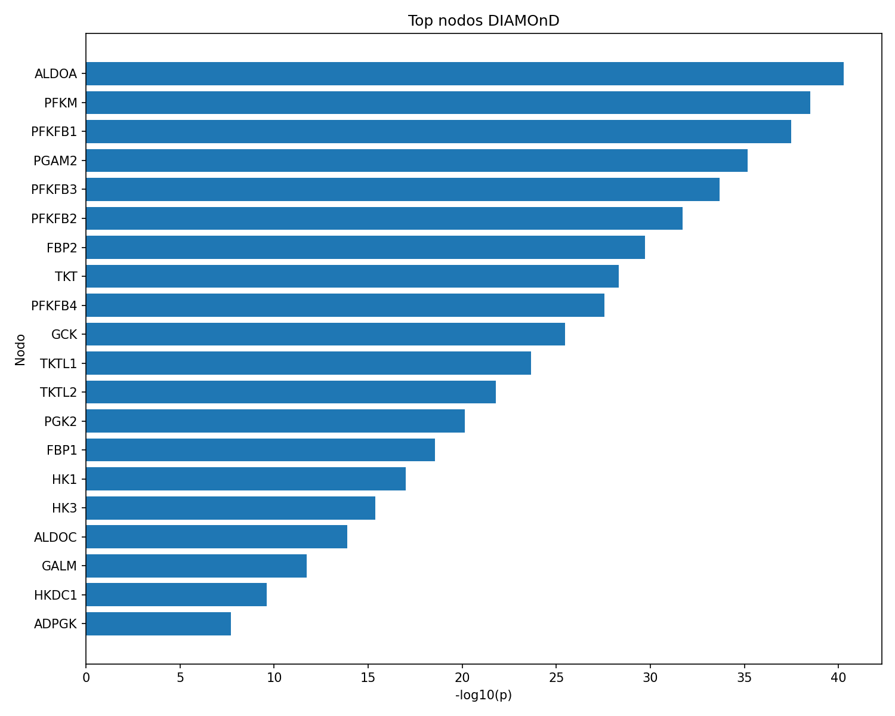

# Tarea 2: Network Propagation
---
- **Autor**: Rubén M. Rodríguez Chamorro

- **Asignatura**: Herramientas biológicas

- **Fecha**: 2 Noviembre 2025
---
<details>
<summary>Mostrar Enunciado</summary>

Escribe un script en Python que implemente un ejemplo de propagación en redes utilizando algún algoritmo de **GUILD** y/o **DIAMOnD**. Usa los genes **ENO1**, **PGK1** y **HK2** como semillas. Se proporcionan archivos de red formateada para ambos algoritmos, así como una red filtrada obtenida de STRING y un script de ejemplo para procesarla.

## Estructura del repositorio

```

/network\_propagation/
├── data/
│   ├── network\_guild.txt                        # Red formateada para GUILD
│   ├── network\_diamond.txt                      # Red formateada para DIAMOnD
│   ├── string\_network\_filtered\_hugo-400.tsv     # Red filtrada de STRING
│   └── genes\_seed.txt                           # Genes semilla: ENO1, PGK1, HK2
├── scripts/
│   ├── process\_STRING.py                        # Script de ejemplo para procesar la red
│   └── tu\_script.py                             # Script que debe entregar el estudiante
├── results/                                     # Carpeta para resultados generados
├── README.md                                    # Este archivo
└── requirements.txt                             # Dependencias: networkx, pandas

```

## Instrucciones de entrega

- Haz un **fork** de este repositorio en tu cuenta de GitHub.
- Trabaja en tu fork y sube tu script a la carpeta `scripts/`.
- Tu script debe poder ejecutarse desde la línea de comandos (CLI), aceptando como mínimo el archivo de entrada y el archivo de salida como argumentos.
- Documenta tu código explicando los métodos, librerías y algoritmos utilizados.
- Puedes generar un archivo de resultados en la carpeta `results/` si lo consideras útil.

## Rúbrica de evaluación

La tarea se evaluará sobre un máximo de **10 puntos**, distribuidos según los siguientes criterios:

| Criterio | Descripción | Puntos |
|---------|-------------|--------|
| **1. Funcionalidad** | El script realiza correctamente la propagación en red con GUILD y/o DIAMOnD. | 4 |
| **2. Documentación** | El código está comentado y explica claramente los métodos y algoritmos utilizados. | 2 |
| **3. Uso de librerías** | Se emplean librerías adecuadas para el análisis de redes (e.g., networkx, pandas). | 2 |
| **4. Formato y estilo** | El código sigue buenas prácticas de estilo y es legible. | 1 |
| **5. Automatización (CLI)** | El script acepta argumentos desde la línea de comandos. | 1 |

## Dependencias recomendadas

Incluye en `requirements.txt` las librerías necesarias para ejecutar tu script. Por ejemplo:

```

networkx
pandas

```

</details>


---

## Descripción

En esta práctica implementamos el algoritmo de propagación en redes **DIAMOnD** en Python sobre una red de interacción de proteínas (STRING HUGO). 
Como semillas utilizamos los genes **ENO1, PGK1, HK2**.

DIAMOnD permite identificar nodos relevantes en la red que podrían estar funcionalmente relacionados con las semillas, expandiendo así el "módulo de enfermedad" a partir del conocimiento previo.

---

## Uso

1. **Instala las dependencias:**  
   (preferiblemente en un entorno virtual)


2. **Ejecuta el script** desde la raíz del repo:

```{bash}
python scripts/rubenscript.py
--network data/string_network_filtered_hugo-400.tsv
--network-format string
--seeds data/genes_seed.txt
--k 200
--outdir results
```


3. **Se generarán los siguientes resultados en `/results`:**
- `diamond_ranking.tsv`: Tabla con los nodos del ranking DIAMOnD y sus p-valores.
- `top20_barplot.png`: Gráfico de barras con los 20 nodos más significativos.
- `diamond_params.json`: Metainformación de la corrida (semillas, parámetros, red, etc).
- `subgraph_top50.edgelist`: Subred extraída de los 50 principales nodos.

---

## Ejemplo de resultados

### Top 20 nodos según DIAMOnD



- El gráfico muestra los 20 nodos de la red más relevantes según DIAMOnD, medidos por el -log10(p-valor).
- Entre los nodos principales aparecen genes relacionados con el metabolismo glucolítico y la red de semilla (p. ej., **ALDOA**, **PKM**, **HK1**, **HK3**, **FBP1**), lo que valida biológicamente tanto el algoritmo como la red empleada.

### Ranking producido (`diamond_ranking.tsv`)

| rank | node   | k_links_to_module | p_value         |
|------|--------|-------------------|-----------------|
| 1    | ADPGK  | 3                 | 1.97e-08        |
| 2    | HKDC1  | 4                 | 2.55e-10        |
| 3    | GALM   | 5                 | 1.84e-12        |
| ...  | ...    | ...               | ...             |
| 20   | ALDOA  | 21                | 5.28e-41        |

- Este archivo permite ver el orden de propagación y el grado de conexión funcional de cada nodo con las semillas.

### Metadatos (`diamond_params.json`)

```{bash}

{
"network": "data/string_network_filtered_hugo-400.tsv",
"nodes": 18889,
"edges": 894129,
"seeds_input": ["ENO1", "HK2", "PGK1"],
"seeds_in_network": ["ENO1", "HK2", "PGK1"],
"k": 200,
"scipy_available": true
}
```

- El script detecta si las semillas están en la red y confirma el uso de la versión eficiente (SciPy).

---

## Interpretación de resultados

- **DIAMOnD** identifica genes conectados funcionalmente a las semillas iniciales en la red de proteínas, priorizando aquellos con mayor asociación estadística basada en hipergeometría.
- El ranking obtenido permite generar hipótesis sobre otros posibles miembros funcionales del módulo, útiles para estudios posteriores (por ejemplo, genes candidatos o relaciones clave).
- La subred generada y la gráfica permiten visualizar y explorar los resultados de forma reproducible.

---

## Dependencias

- `pandas`
- `numpy`
- `matplotlib`
- `networkx`
- `scipy`

---

## Contacto y licencia

Entrega elaborada por [Rvbenrch].  
Licencia MIT.


